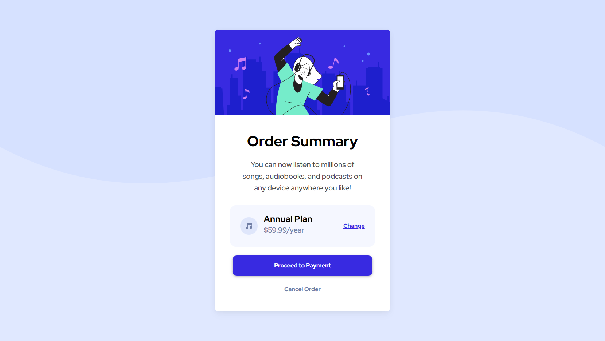

  

<h3 align="center">Order Summary Card</h3>

---

 Order Summary Card Component from Frontend Mentor
     

## 📝 Table of Contents

- [About](#about)
- [Built Using](#built_using)
- [Authors](#authors)
- [Acknowledgments](#acknowledgement)

## 🧠About 

Basic order summary card for a music streaming service subscripiton, single-page, made using mainly Bootstrap, some SASS for additional styling. The project was made for Frontend Mentor to practice my skills and learn some new stuff.

## 🚀 Deployment 

- [Live View](https://seesmof.github.io/fm-order-summary-component/)

## ⛏️ Built Using 

- [HTML](https://www.w3.org/html/) - Markup Language
- [CSS](https://www.w3schools.com/css/) - Styling Language
- [SASS](https://sass-lang.com/) - CSS Pre-Processor
- [Bootstrap](https://getbootstrap.com/) - CSS Framework

## ✍️ Authors 

- [@seesmof](https://github.com/seesmof) - Development
- [@frontendmentorio](https://github.com/frontendmentorio) - Idea & Desing

## 🉠Acknowledgements 

- [@frontendmentorio](https://github.com/frontendmentorio) for great projects
